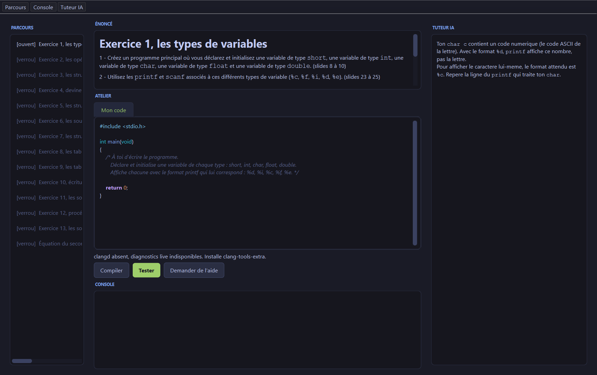
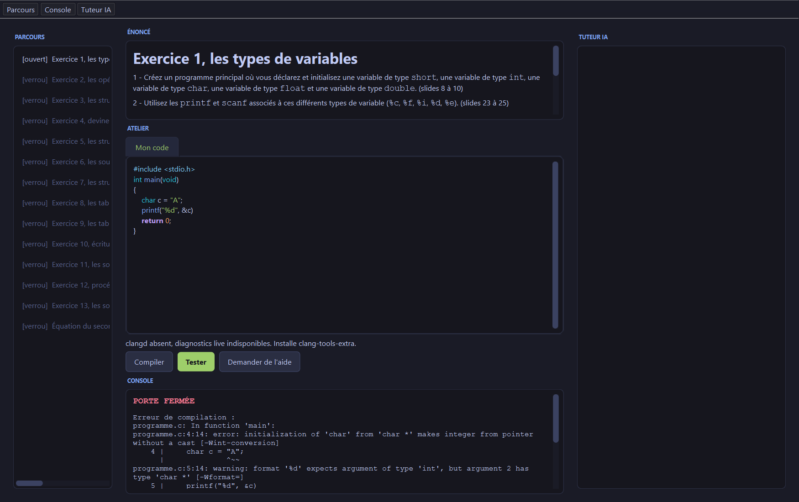
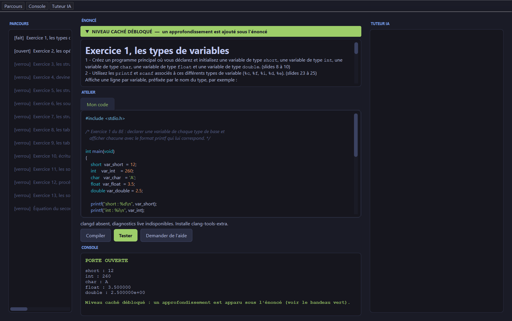
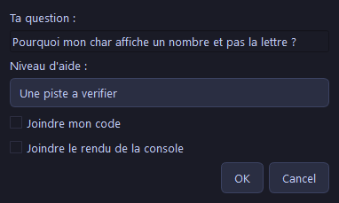

# TP C, les exercices d'introduction au langage C

Un atelier de bureau pour Windows : 14 exercices d'introduction au langage C. Pour
chaque exercice vous ecrivez un petit programme complet, vous cliquez pour compiler et
tester, et une porte s'ouvre quand la sortie est correcte.

## A quoi ca sert

Les 14 exercices couvrent : les types et la taille des types, les operateurs, les
structures, les pointeurs, les tableaux, les structures de controle, les
sous-programmes, le passage par adresse, la lecture d'un fichier, et l'equation du
second degre.

Chaque exercice est autonome : un enonce en haut, un editeur de code au centre, une
console en bas, et un panneau tuteur optionnel a droite.

## Prerequis

Un Windows 64 bits. **Rien d'autre a installer** pour le coeur de l'atelier : Python et
le compilateur gcc sont deja fournis dans ce dossier.

## Comment lancer

1. Decompressez ce dossier ou vous voulez (le Bureau, par exemple).
2. Double-cliquez sur **`lancer.bat`**.

La fenetre s'ouvre sur le premier exercice.

Si quelque chose cloche, lancez d'abord **`diagnostic.bat`** : il verifie que gcc,
Python et l'affichage repondent, et affiche un message clair.

## Comment ca marche, exercice par exercice

1. Lisez l'enonce en haut de la fenetre.
2. Ecrivez votre programme dans l'editeur.
3. Cliquez sur **Compiler** pour voir les erreurs du compilateur. Elles pointent la
   ligne et la colonne exactes, sans chemin de fichier parasite.
4. Cliquez sur **Tester** pour franchir la porte.

Si la porte s'ouvre, c'est gagne. Sinon, le message vous explique precisement ce qui
manque dans votre sortie. Les exercices sont independants : faites-les dans l'ordre que
vous voulez.

### Le niveau cache

Quand vous validez un exercice, un niveau cache peut se debloquer : un **bandeau vert**
apparait sous le titre ENONCE et un approfondissement s'ajoute au bas de l'enonce. Il va
un peu plus loin que la consigne de base, pour ceux qui veulent creuser.

## Le tuteur IA (optionnel)

Un bouton **Demander de l'aide** peut vous repondre pendant un exercice, **sans jamais
donner la solution toute faite**. Il repond court et direct, nomme ce qui cloche et le
concept en jeu, mais vous laisse ecrire la correction vous-meme (les lignes du corrige
sont masquees).

Vous posez votre question, choisissez le niveau d'aide voulu (vous pouvez demander
**moins** d'aide que le maximum debloque), et decidez si vous joignez votre code et le
rendu de la console. Par defaut, le tuteur ne voit que l'enonce et votre question.

**Le tuteur est OPTIONNEL.** Les exercices fonctionnent entierement sans lui.

Pour l'activer, il faut un outil IA en ligne de commande, installe et connecte avec
votre propre compte. Deux sont reconnus :

- **Claude Code** (commande `claude`)
- **Codex** (commande `codex`)

Installez et connectez celui pour lequel vous avez un compte. S'il est present sur la
machine (dans le PATH) et connecte, le tuteur s'allume tout seul au lancement.

- Pour verifier qu'il repond, ouvrez un terminal et tapez, selon le cas :
  `claude -p "dis bonjour"` ou `codex exec "dis bonjour"`. Si vous obtenez une reponse,
  le tuteur fonctionnera.
- Si les deux outils sont presents, Claude est choisi par defaut. Pour forcer l'un ou
  l'autre, definissez la variable d'environnement `ATELIER_AI` a `claude` ou a `codex`
  avant de lancer `lancer.bat`.

Note : ces outils sont payants et n'ont pas d'essai gratuit dedie. Sans aucun des deux,
l'atelier reste pleinement utilisable, simplement sans l'aide IA.

## En cas de probleme

- **La fenetre ne s'ouvre pas** : lancez `diagnostic.bat`, il indique ce qui manque.
- **Une erreur "gcc introuvable"** : lancez l'atelier par `lancer.bat` (il ajoute le
  compilateur au PATH). L'atelier trouve aussi gcc tout seul si le dossier `w64devkit`
  est bien reste a cote de l'application.
- **Le tuteur reste eteint** : c'est normal si aucun outil IA n'est installe ou
  connecte. L'atelier fonctionne sans.
