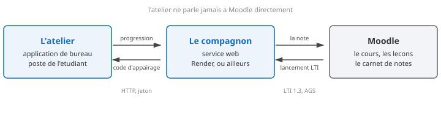
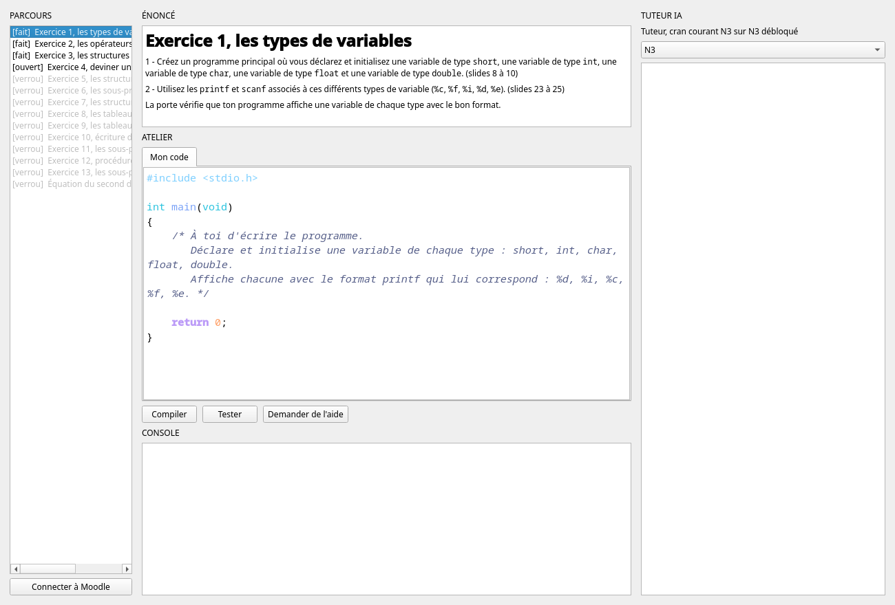
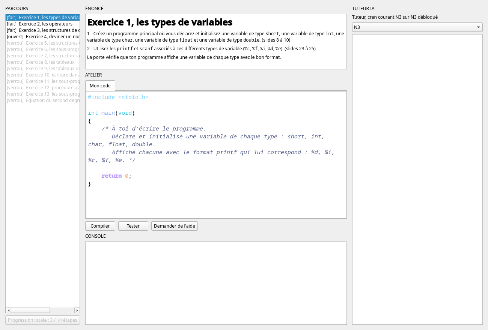
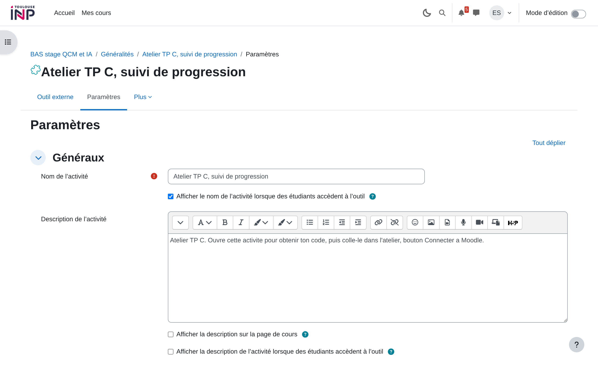
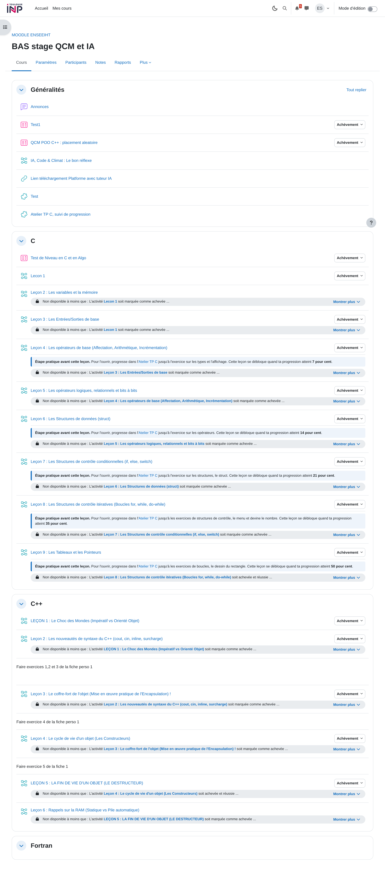
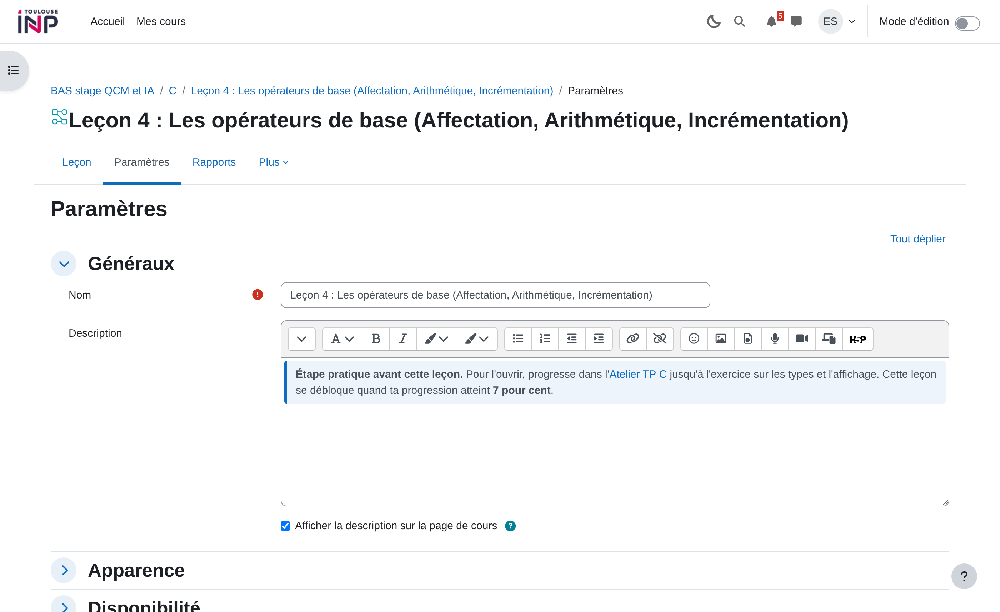

# Guide de la plateforme Atelier TP C

Ce guide explique comment faire vivre la plateforme sans lire le code. Il s'adresse à
l'enseignant qui écrit les exercices et à la personne qui installe le service.

Il décrit l'état réel du 16 juillet 2026, vérifié sur la machine et sur le Moodle de l'école.
Les spécifications du dépôt sont plus anciennes et par endroits fausses, ce guide les corrige.

---

# 1. Les trois morceaux

La plateforme est faite de trois choses distinctes. Les confondre est la première source de
confusion.



**L'atelier** est une application de bureau écrite en Python avec PyQt6. Elle tourne sur le
poste de l'étudiant. Elle contient les exercices, compile le code C, décide si un exercice
est réussi et héberge le tuteur IA. Elle fonctionne très bien toute seule, sans réseau.

**Le compagnon** est un petit service web écrit en Flask. Il ne sert qu'à faire le pont vers
Moodle. Il reçoit la progression de l'atelier et pousse une note dans le carnet. Il ne
contient aucun exercice et ne sait pas ce qu'est un exercice.

**Moodle** est le site de l'école. Il héberge le cours, les leçons de théorie et le carnet
de notes.

Le point important : **l'atelier ne parle jamais à Moodle directement.** Il parle au
compagnon, et c'est le compagnon qui parle à Moodle. Cela veut dire que si vous n'avez pas
besoin des notes dans Moodle, vous n'avez pas besoin du compagnon du tout. C'est le mode
local, décrit au chapitre 5.

## Ce qui relie l'atelier au compagnon

L'étudiant clique sur l'activité dans Moodle. Le compagnon lui affiche un code de six
caractères. L'étudiant colle ce code dans l'atelier. L'atelier reçoit alors un jeton
permanent et remonte sa progression au fil de l'eau.

Le code est valable dix minutes. Le jeton, lui, ne périme pas.

---

# 2. Installer et lancer

## Ce qu'il faut sur le poste

Python 3, PyQt6, et `gcc` pour compiler le C des étudiants. Le tuteur IA a besoin en plus
d'un moteur, Claude Code ou Codex, mais l'atelier fonctionne sans lui.

## Lancer

Toutes les commandes de ce guide se lancent depuis la racine du dépôt, celle qui contient
`atelier_snake.py` et le dossier `contenu/`. Le dépôt s'appelle chez vous comme vous l'avez
cloné, il n'y a pas de sous-dossier à traverser.

```
python3 atelier_snake.py --parcours be_c
```

`be_c` est le parcours réel du BE, celui qu'il faut donner aux étudiants. **Sans l'option
`--parcours`, l'atelier démarre sur `hybride`, une maquette de deux exercices.** Mettez
toujours l'option.

Les autres options utiles :

| Option | Effet |
|---|---|
| `--parcours <nom>` | choisit le parcours, voir le chapitre 3 |
| `--demo` | tout est déverrouillé, un bouton charge le corrigé |
| `--selftest` | vérifie les portes sans ouvrir de fenêtre |
| `--smoketest` | construit la fenêtre sans l'afficher, pour vérifier que rien n'est cassé |



*L'atelier sur le parcours be_c. À gauche, les quatorze exercices avec leur état. Trois sont
faits, le quatrième est ouvert, les suivants sont verrouillés. En bas à gauche, le bouton de
liaison avec Moodle.*

---

# 3. Le contenu, les parcours et les questions

C'est le chapitre le plus utile au quotidien. **Tout le contenu est fait de fichiers, aucune
modification du code source n'est nécessaire pour écrire des exercices.**

## Le modèle, en trois phrases

Un **parcours** est un dossier dans `contenu/`. Il contient un fichier `parcours.json` qui
donne la liste ordonnée des étapes. Une **étape** est un sous-dossier qui contient un
`meta.json` et les fichiers de l'exercice.

L'ordre du tableau dans `parcours.json` est l'ordre de déverrouillage. Rien d'autre ne classe
les étapes. Une étape s'ouvre quand toutes celles qui la précèdent dans ce tableau sont
faites.

## Les parcours qui existent

| Parcours | Étapes | À quoi il sert |
|---|---|---|
| `be_c` | 14 | **le vrai BE, c'est celui à utiliser** |
| `projet` | 3 | le vrai jeu Snake, voir le chapitre 4 |
| `tp_c` | 4 | ancien jeu d'exercices, remplacé par `be_c` |
| `bonus_pointeurs` | 3 | exercices supplémentaires sur les pointeurs |
| `hybride` | 2 | maquette d'origine, **c'est le défaut si on oublie l'option** |
| `perso` | 4 | exercices inventés, abandonnés |

## L'outil qui fait tout le travail

`atelier_contenu.py` crée, vérifie et retire les étapes et les parcours. Il évite d'écrire du
JSON à la main et il vérifie que le résultat fonctionne vraiment.

```
python3 atelier_contenu.py lister
python3 atelier_contenu.py lister be_c
python3 atelier_contenu.py nouveau-parcours <nom>
python3 atelier_contenu.py nouvelle-etape <parcours> <id> --titre "..."
python3 atelier_contenu.py retirer-etape <parcours> <id>
python3 atelier_contenu.py verifier [<parcours>]
python3 atelier_contenu.py notation
```

`notation` sert rarement. Elle réaligne sur le contenu la liste des étapes que le compagnon
note, quand un `parcours.json` a été modifié en dehors de cet outil. Voyez « Le nombre
d'étapes doit suivre », plus bas dans ce chapitre.

Trois options complètent ces commandes :

| Option | Sur quelle commande | À quoi elle sert |
|---|---|---|
| `--apres <id>` | `nouvelle-etape` | insère l'étape juste après celle-ci, au lieu de la fin |
| `--cran N` | `nouvelle-etape` | fixe `cran_debloque`, le niveau de tuteur IA que l'étape ouvre. Sans l'option, 1 |
| `--effacer` | `retirer-etape` | supprime aussi le dossier du disque, et pas seulement la ligne du parcours |

**`verifier` est la commande la plus importante du guide.** Elle compile le corrigé de chaque
étape et vérifie qu'il passe l'épreuve, puis compile le fichier de départ et vérifie qu'il
échoue. C'est ce qui garantit qu'un exercice est réellement faisable et réellement exigeant.
Lancez-la après chaque modification de contenu.

```
$ python3 atelier_contenu.py verifier be_c
be_c/ex01_types ... ok
be_c/ex02_operateurs ... ok
...
be_c/ex_second_degre ... ok
```

Elle prend quelques secondes et renvoie un code d'erreur si quelque chose ne va pas.

## Anatomie d'une étape

Prenons `contenu/be_c/ex01_types/`. Le dossier contient quatre fichiers.

| Fichier | Rôle |
|---|---|
| `enonce.md` | le texte de la question, en Markdown. C'est ce que lit l'étudiant. |
| `starter.c` | le code de départ affiché à l'étudiant. Il **doit échouer** à l'épreuve. |
| `corrige.c` | la solution de référence. Jamais montrée. Elle **doit réussir** l'épreuve. |
| `meta.json` | la fiche technique de l'étape. |

Le `meta.json` réel de cet exercice :

```json
{
  "id": "ex01_types",
  "titre": "Exercice 1, les types de variables",
  "type": "programme",
  "mode": "programme",
  "cran_debloque": 1,
  "noeud_cours": "BE C, exercice 1, les types de base, slides 8 a 10",
  "fichier_edite": "programme.c",
  "sortie_attendue": [
    "short : 12",
    "int : 260",
    "char : A",
    "float : 3.500000",
    "double : 2.500000e+00"
  ]
}
```

Les champs, un par un :

| Champ | Ce qu'il fait vraiment |
|---|---|
| `id` | l'identifiant, il doit être identique au nom du dossier |
| `titre` | le titre affiché dans la liste de gauche |
| `type` | libre en pratique, `programme` pour tout `be_c` |
| `mode` | **le champ qui décide de tout**, voir plus bas |
| `cran_debloque` | le niveau de tuteur IA que l'étape ouvre |
| `noeud_cours` | une note d'auteur, elle dit à quelle partie du cours l'exercice se rattache |
| `fichier_edite` | le nom du fichier écrit sur le disque |
| `sortie_attendue` | les lignes que le programme de l'étudiant doit afficher |
| `entree` | ce qui est envoyé au programme sur l'entrée standard |

Seuls `id`, `titre`, `type` et `fichier_edite` sont obligatoires. Sans eux, l'étape ne charge
pas du tout.

## Comment une étape est jugée réussie

C'est le champ `mode` qui décide, et lui seul.

| `mode` | Comment l'étape est jugée |
|---|---|
| `programme` | le programme est compilé, `entree` lui est envoyée, et **chaque ligne de `sortie_attendue` doit apparaître telle quelle dans ce qu'il affiche** |
| `test_fourni` | le code de l'étudiant est compilé avec un `tests.c` fourni. **Le code de sortie fait foi**, zéro veut dire réussi. Le texte affiché n'a aucune importance. |
| `test_a_ecrire` | l'étudiant écrit lui-même le test. Son test est d'abord jugé solide, puis appliqué à son code. |

Tout `be_c` est en mode `programme`. C'est le mode à utiliser pour un nouvel exercice.

Si `sortie_attendue` est vide ou absente, l'étape est validée dès que le programme compile
et se termine normalement. C'est utile pour un exercice d'exploration sans bonne réponse.

## Changer le texte d'une question

Éditez `contenu/<parcours>/<etape>/enonce.md`. C'est du Markdown, il n'y a rien d'autre à
faire.

Si vous changez ce que l'exercice demande, changez aussi `sortie_attendue` dans `meta.json` et
le `corrige.c`. Sinon l'énoncé et l'épreuve ne diront plus la même chose. Lancez `verifier`
derrière, il vous le dira.

## Ajouter un niveau

> **Après avoir ajouté ou retiré une étape de `be_c`, redéployez le compagnon.** L'outil met
> la liste des étapes notées à jour tout seul et vous le dit. Le service en ligne, lui, garde
> l'ancienne liste jusqu'au redéploiement, et note dessus. Voir « Le nombre d'étapes doit
> suivre » à la fin de ce chapitre.

```
python3 atelier_contenu.py nouvelle-etape be_c ex15_matrices \
    --titre "Exercice 15, les matrices"
```

La commande crée le dossier, les quatre fichiers, et insère l'étape à la fin du parcours.
Pour la placer ailleurs, utilisez `--apres` :

```
python3 atelier_contenu.py nouvelle-etape be_c ex06b_boucles \
    --titre "..." --apres ex06_rectangle_sp
```

**Ce que la commande produit est déjà un exercice valide et vérifié.** Il est trivial, il
demande d'afficher une ligne, mais il fonctionne. C'est voulu : `verifier` est vert dès la
création, donc s'il passe au rouge ensuite, c'est votre modification qui l'a fait.

Ensuite, éditez dans cet ordre :

1. `enonce.md`, pour écrire la question.
2. `corrige.c`, pour écrire la solution.
3. `meta.json`, pour mettre `sortie_attendue` en accord avec ce que le corrigé affiche.
4. `starter.c`, pour donner à l'étudiant un point de départ qui ne passe pas encore.
5. `python3 atelier_contenu.py verifier be_c`, pour vérifier le tout.

Le vérificateur refuse trois erreurs classiques, avec un message qui dit quoi faire :

```
$ python3 atelier_contenu.py verifier be_c
be_c/ex15_matrices ... le corrigé ne passe pas la porte :
Il manque ceci dans ta sortie : 'somme : 42'

Sortie obtenue :
somme: 42
```

Ici l'espace manquant avant les deux-points suffit à faire échouer. La comparaison est
littérale.

## Retirer un niveau

```
python3 atelier_contenu.py retirer-etape be_c ex15_matrices
```

L'étape sort du parcours mais le dossier reste sur le disque, au cas où. Ajoutez `--effacer`
pour supprimer aussi le dossier.

Une étape retirée d'un parcours n'est plus jamais chargée. Si des étudiants l'avaient déjà
validée, leur `progression.json` garde son nom sans que cela pose problème, la ligne est
simplement ignorée.

**En revanche, la note, elle, demande une attention.** Retirer une étape d'un parcours noté
change la liste des étapes notées, exactement comme en ajouter une, et le compagnon devra être
redéployé. Voyez « Le nombre d'étapes doit suivre », à la fin de ce chapitre.

## Créer un parcours

```
python3 atelier_contenu.py nouveau-parcours mon_td
python3 atelier_contenu.py nouvelle-etape mon_td ex01_intro --titre "Premier exercice"
python3 atelier_contenu.py verifier mon_td
python3 atelier_snake.py --parcours mon_td
```

C'est tout. Il n'y a aucun registre à mettre à jour ailleurs : tout dossier de `contenu/` qui
contient un `parcours.json` valide est un parcours utilisable.

## Quatre pièges du modèle

Ces points sont contre-intuitifs et le code ne les signale pas.

**Le champ `type` ment.** Un commentaire dans le code annonce que `type` vaut `perso`, `jalon`
ou `projet`. C'est faux. Tout `be_c` utilise `type: "programme"`, qui n'est pas dans cette
liste. Ce champ ne sert presque à rien, c'est `mode` qui commande.

**Le champ `recette` ne sert à rien du tout.** Il est lu dans le fichier puis jamais utilisé.
Vous pouvez l'ignorer.

**Le champ `noeud_cours` non plus.** Il n'est jamais affiché. C'est une note pour vous, ce qui
reste utile, mais ne comptez pas le voir apparaître à l'écran.

**Le champ `fichier_edite` est ignoré en mode `programme` et `test_fourni`.** Le fichier écrit
sur le disque s'appelle toujours `programme.c` dans le premier cas et `soumission.c` dans le
second, quoi que vous mettiez dans le `meta.json`. Renseignez-le correctement quand même, par
convention, mais ne cherchez pas à changer le nom par ce biais.

## Le nombre d'étapes doit suivre

Le compagnon ne connaît pas votre contenu. Il ne sait pas ce qu'est un exercice et il ne lit
jamais le dossier `contenu/`, car son image ne l'embarque pas. Tout ce qu'il sait du parcours
qu'il note tient dans un fichier, `compagnon/etapes_notees.json`, qui en liste les étapes.

Ce fichier redit ce que `parcours.json` dit déjà. Deux copies d'un même fait finissent
toujours par diverger, alors trois choses les tiennent ensemble.

D'abord, `atelier_contenu.py` met la liste à jour tout seul. Dès que vous touchez au parcours
noté, il réécrit le fichier et vous le dit :

```
$ python3 atelier_contenu.py nouvelle-etape be_c ex15_matrices --titre "Matrices"
Étape ex15_matrices créée dans be_c.
be_c est le parcours noté : la liste du compagnon suit, 15 étape(s).
Le compagnon doit être redéployé pour que les notes en tiennent compte.
```

Ensuite, un test refuse que les deux divergent. `tests/test_etapes_notees.py` est le seul
endroit du dépôt d'où l'on voit à la fois le contenu et la liste du compagnon. S'il casse,
réparez la liste, avec la commande `notation`.

Enfin, le nombre d'étapes se déduit de la liste. Il n'est plus tapé nulle part, donc il ne
peut plus être faux tout seul.

**Le seul geste qui reste à votre charge est le redéploiement du compagnon.** Tant que vous ne
l'avez pas fait, le service en ligne note sur l'ancienne liste. Le chapitre 6 explique
comment.

Si vous travaillez en mode local, sans compagnon, rien de ceci ne vous concerne. Le relevé
compte les étapes du parcours qu'il a sous les yeux.

> Jusqu'au 16 juillet 2026, ce rôle était tenu par une variable d'environnement nommée
> `TOTAL_ETAPES`, que l'on tapait à la main dans le tableau de bord de l'hébergeur. Aucun test
> ne pouvait la lire et rien ne l'obligeait à suivre le contenu. Elle est désormais ignorée.
> Si elle traîne encore sur votre déploiement, le compagnon le signale dans ses journaux et
> vous pouvez la retirer.

---

# 4. La version projet

Le parcours `projet` fonctionne autrement que les autres, il mérite une explication.

Dans les parcours ordinaires, chaque exercice est isolé. L'étudiant écrit un petit programme
dans son coin, il est jugé, on passe au suivant. Rien ne s'accumule.

Dans la version projet, l'étudiant complète le **vrai jeu Snake**, morceau par morceau. Le
dépôt contient deux arbres complets : `projet-corrige/`, le jeu qui marche, et
`projet-squelette/`, le même jeu avec les fonctions à écrire vidées. Au premier lancement,
le squelette est copié dans `espace_session/`, qui devient l'espace de travail vivant de
l'étudiant. Chaque étape lui fait remplir un vrai fichier de ce projet, et le code s'empile
d'une étape à l'autre.

Les étapes de ce parcours sont jugées différemment. Une étape `porte: "logique"` compile un
harnais de test contre les sources de l'étudiant. L'étape finale, `porte: "build"`, compile
le jeu entier et le lance. Réussir cette dernière étape, c'est avoir un Snake jouable.

C'est bien plus lourd à écrire qu'un parcours ordinaire. Créer un nouveau parcours projet
demande un arbre de projet corrigé, un arbre squelette, un script de compilation et des
harnais en C. **`atelier_contenu.py` ne sait pas fabriquer ça.** Pour un nouveau parcours
projet, il faut copier l'existant et l'adapter à la main.

---

# 5. Le suivi de la progression

L'atelier sait où en est l'étudiant. La question de ce chapitre est de savoir qui d'autre le
sait, et à quel prix.

## Le fichier de mémoire

Quel que soit le mode, l'atelier écrit sa progression dans `progression.json`, à côté du
code :

```json
{
  "etapes_faites": ["ex01_types", "ex02_operateurs"],
  "cran_max": 1
}
```

C'est tout. **Ce fichier suffit à faire fonctionner l'atelier.** Le reste de ce chapitre ne
sert qu'à faire remonter cette information ailleurs.

## Choisir un mode

| Mode | Serveur | Notes dans Moodle | Coût | Pour qui |
|---|---|---|---|---|
| **local** | aucun | non | rien | une salle sans réseau, un essai, un repli |
| **compagnon auto-hébergé** | le vôtre | oui | une machine | un vrai cours |
| **compagnon sur Render** | Render | oui | gratuit, mais il dort | ce qui tourne aujourd'hui |

## Le mode local

C'est le mode le plus simple et le plus robuste. Il n'y a pas de serveur, donc rien ne peut
tomber en panne.

```
ATELIER_SUIVI=local python3 atelier_snake.py --parcours be_c
```

En mode local, l'atelier ne fait **aucune** requête réseau, jamais. C'est un interrupteur
franc et non une simple absence de connexion : même si un appairage traîne sur le disque
depuis un usage précédent, rien ne part.

Le bouton de liaison Moodle est remplacé par un indicateur de progression.



*En mode local, le bouton devient un indicateur. Il n'y a rien à connecter.*

### Le relevé

Puisque rien ne remonte, l'étudiant a besoin d'un moyen de montrer son travail. La commande
`--releve` produit un fichier lisible :

```
python3 atelier_snake.py --releve --parcours be_c
```

```
Relevé de progression, Atelier TP C
Parcours : be_c
Établi le : 2026-07-16 09:35 UTC

Étapes validées : 2 sur 14, soit 14.3 %

  [x] ex01_types            Exercice 1, les types de variables
  [x] ex02_operateurs       Exercice 2, les opérateurs
  [ ] ex03_menu             Exercice 3, les structures de contrôle
  ...

Empreinte : 6e32cdc7
```

L'étudiant dépose ce fichier dans un devoir Moodle ordinaire. Le pourcentage suit la même
formule que celui du compagnon.

Le relevé compte les étapes du parcours qu'il a sous les yeux, il est donc toujours juste. Le
compagnon, lui, ne voit pas le contenu et s'appuie sur la liste décrite au chapitre 3. Les
deux chiffres coïncident tant que le compagnon a été redéployé depuis le dernier changement
de contenu.

> **L'empreinte détecte une modification accidentelle du fichier, rien de plus.** Elle ne
> protège pas contre une falsification volontaire : l'algorithme est dans le code que
> l'étudiant possède, et il peut de toute façon éditer `progression.json` directement. Ce
> relevé vaut ce que vaut un devoir rendu, la confiance. Pour une preuve opposable, il faut
> un mode avec serveur.

### Ce que le mode local coûte

Vous perdez les notes automatiques dans le carnet, et donc le déverrouillage automatique des
leçons décrit au chapitre 7. Le lien entre théorie et pratique redevient manuel.

## Le mode compagnon

L'atelier remonte la progression au compagnon, qui pousse une note dans Moodle. C'est le mode
par défaut, il n'y a rien à faire pour l'activer.

Pour viser un autre compagnon que celui d'origine :

```
export ATELIER_COMPAGNON_URL=https://mon-serveur.example
python3 atelier_snake.py --parcours be_c
```

> **Un appairage vaut pour un serveur, et un seul.** Le jeton est délivré par un compagnon
> précis, il ne vaut rien sur un autre. Si vous changez de serveur, chaque étudiant doit
> recliquer l'activité dans Moodle pour se réappairer. L'atelier détecte le cas et l'annonce
> dans la console au démarrage, plutôt que d'envoyer sa progression dans le vide.

## L'état de l'hébergement Render, mesuré

Ce point gouverne l'expérience de tous les étudiants.

Le plan gratuit de Render endort le service après quinze minutes sans visite. Le réveil prend
une trentaine de secondes, mesuré à 32,8 secondes le 16 juillet 2026. Pendant ce temps,
l'étudiant tombe sur une page qui lui demande d'appuyer sur F5.

Une tâche planifiée réveille le service toutes les dix minutes, en théorie. **En pratique elle
ne fonctionne pas.** Mesure des vingt derniers passages :

| Ce qui est demandé | Ce qui se passe vraiment |
|---|---|
| un passage toutes les 10 minutes | médiane de 90 minutes, minimum 54, maximum 201 |
| le service reste éveillé | **les 19 intervalles mesurés dépassent les 15 minutes** |

GitHub bride fortement les tâches planifiées des dépôts peu actifs. La conséquence est simple
et elle est vérifiée : **le service dort quasiment tout le temps, et presque chaque étudiant
paiera le réveil et le F5.** Le maintien à chaud est un cache-misère qui ne tient pas ses
promesses.

Deuxième problème du plan gratuit : **le disque est effacé à chaque déploiement.** Tous les
appairages sont perdus et chaque étudiant doit se réappairer. Ne redéployez jamais pendant
une séance.

## Que faire

Aucun réglage ne supprime le sommeil de Render. C'est le modèle économique du plan gratuit.
Trois sorties possibles :

1. **Un plan payant chez Render**, autour de 7 dollars par mois. Le service ne dort plus, rien
   d'autre ne change, et c'est un basculement d'une minute.
2. **Héberger le compagnon à l'école.** C'est la vraie solution à terme. Il faut une machine
   joignable en HTTPS depuis les navigateurs des étudiants, et le `Dockerfile` du dossier
   `compagnon/` suffit à le faire tourner.
3. **Le mode local**, si les notes automatiques ne valent pas le coût d'un serveur.

Le mode local est aussi le bon repli le jour où le compagnon est en panne pendant une séance.
Il suffit d'une variable d'environnement, il n'y a rien à réinstaller.

---

# 6. Le compagnon et l'authentification Moodle

Ce chapitre n'est utile que si vous voulez les notes dans Moodle. En mode local, sautez-le.

## Ce que LTI fait, en clair

LTI est le protocole standard qui permet à Moodle de lancer un outil extérieur en disant qui
est l'étudiant, et qui permet à cet outil de renvoyer une note. Sans LTI, il faudrait
demander à l'étudiant de s'identifier lui-même, ce qui serait à la fois pénible et peu sûr.

Le principe est celui d'une signature. Moodle et le compagnon possèdent chacun une paire de
clés. Moodle signe un message qui dit « voici l'étudiant Untel, du cours 4665 ». Le compagnon
vérifie la signature avec la clé publique de Moodle. Personne ne peut donc se faire passer
pour un autre.

Le déroulé complet, quand un étudiant clique sur l'activité :

1. Moodle appelle `/lti/login` du compagnon pour amorcer la connexion.
2. Le compagnon renvoie l'étudiant vers Moodle, qui signe un jeton d'identité.
3. Moodle poste ce jeton sur `/lti/launch`. Le compagnon vérifie la signature.
4. Le compagnon crée un appairage et affiche un code de six caractères.
5. L'étudiant colle le code dans l'atelier, qui reçoit un jeton permanent.
6. À chaque exercice réussi, l'atelier poste sur `/api/evenements`. Le compagnon recalcule le
   score et le pousse au carnet de Moodle par le service AGS.

## Le score

Le compagnon ne connaît pas les exercices. Il sait seulement quelles étapes il note, par la
liste décrite au chapitre 3, et il applique une règle de trois :

```
score = 100 * (étapes validées qui sont dans la liste) / (taille de la liste)
```

Pour `be_c` la liste compte 14 étapes, donc un exercice vaut 7,14 points.

**L'atelier signale chaque porte franchie sans jamais dire de quel parcours elle vient**, et
les identifiants d'étapes ne se répètent pas d'un parcours à l'autre. C'est pourquoi le
compagnon ne retient que les étapes de sa liste. Sans ce filtre, un étudiant qui s'entraîne
sur un parcours non noté ferait monter sa note du parcours noté. Le cas était réel : quatre
exercices de `perso` faisaient passer une progression de 71,4 % à 100 %.

Les événements sont conservés tels quels et le score est toujours recalculé depuis eux. Un
envoi rejoué deux fois ne compte donc pas double.

## Les variables d'environnement

Le compagnon ne se configure que par l'environnement. Rien n'est écrit en dur dans le code.

| Variable | Rôle |
|---|---|
| `MOODLE_ISS` | l'adresse du Moodle, par exemple `https://moodle.inp-toulouse.fr` |
| `MOODLE_CLIENT_ID` | l'identifiant donné par Moodle à l'enregistrement de l'outil |
| `MOODLE_DEPLOYMENT_ID` | l'identifiant de déploiement, donné par Moodle |
| `MOODLE_AUTH_LOGIN_URL` | l'URL d'authentification de Moodle |
| `MOODLE_AUTH_TOKEN_URL` | l'URL de jeton de Moodle |
| `MOODLE_KEY_SET_URL` | l'URL des clés publiques de Moodle |
| `TOOL_PRIVATE_KEY` | la clé privée du compagnon |
| `TOOL_PUBLIC_KEY` | la clé publique du compagnon |
| `FLASK_SECRET` | le secret de session. Vaut `dev` par défaut, **à changer en production** |
| `COMPAGNON_BASE` | le chemin de la base SQLite. Facultatif |

Les clés se fabriquent avec :

```
python3 -m compagnon.cles
```

La commande affiche les deux clés, à copier dans les variables du tableau ci-dessus. C'est la
forme à utiliser pour Render, où vous les collez dans le formulaire.

**Les deux clés d'un même appel vont ensemble, et seulement celles-là.** Ne lancez pas la
commande deux fois en prenant la clé privée du premier appel et la publique du second : vous
auriez deux clés dépareillées, le compagnon démarrerait sans broncher, sa page d'accueil
s'afficherait normalement, et la panne n'apparaîtrait qu'au premier vrai lancement depuis
Moodle, sous la forme d'une erreur de signature qui ne dit pas d'où elle vient.

Pour un compagnon en local, évitez le copier-coller entièrement avec `--env`, qui écrit les
deux clés d'un seul appel dans un fichier que le shell relit tel quel :

```
python3 -m compagnon.cles --env > cles.env
set -a; . ./cles.env; set +a
```

**Ne mettez jamais ces clés dans un fichier du dépôt.** Ajoutez `cles.env` à votre
`.gitignore`. Sur Render, le disque est effacé à chaque déploiement, donc une clé écrite sur
disque serait perdue de toute façon.

## Lancer le compagnon en local

C'est la façon la plus simple de comprendre le service et de tester sans rien casser.

Préparez l'environnement une fois :

```
python3 -m venv compagnon/.venv
compagnon/.venv/bin/pip install -r compagnon/requirements.txt
```

Fabriquez les clés et donnez-les au shell. Les deux lignes ci-dessous remplissent
`TOOL_PRIVATE_KEY` et `TOOL_PUBLIC_KEY` d'un seul appel, donc avec une paire qui va ensemble :

```
compagnon/.venv/bin/python -m compagnon.cles --env > cles.env
set -a; . ./cles.env; set +a
```

Réglez le reste, puis lancez. Les quatre adresses de Moodle sont celles de l'école, et
`MOODLE_CLIENT_ID` est le numéro que l'administrateur vous donnera au chapitre 7. Pour un
simple essai local sans Moodle, n'importe quelle valeur convient : le service démarre et sa
page d'accueil s'affiche même sans Moodle en face.

```
export MOODLE_ISS="https://moodle.inp-toulouse.fr"
export MOODLE_CLIENT_ID="..."
export MOODLE_DEPLOYMENT_ID="1"
export MOODLE_AUTH_LOGIN_URL="https://moodle.inp-toulouse.fr/mod/lti/auth.php"
export MOODLE_AUTH_TOKEN_URL="https://moodle.inp-toulouse.fr/mod/lti/token.php"
export MOODLE_KEY_SET_URL="https://moodle.inp-toulouse.fr/mod/lti/certs.php"
export COMPAGNON_BASE="/tmp/compagnon-essai.sqlite3"
compagnon/.venv/bin/gunicorn -b 127.0.0.1:8000 compagnon.app:application
```

`COMPAGNON_BASE` compte plus qu'il n'en a l'air : c'est le fichier de base de données.
Pointez-le vers un chemin d'essai comme ci-dessus, sinon votre essai écrit dans la base
réelle.

Ouvrez ensuite `http://127.0.0.1:8000/`. **Cette page affiche elle-même toutes les valeurs à
recopier dans Moodle**, calculées depuis l'adresse par laquelle vous l'avez jointe. C'est la
référence à utiliser, plutôt que de recopier des URL de ce guide qui pourraient vieillir.

Un compagnon en local suffit pour lire le code, comprendre les routes et faire tourner les
tests. Il ne suffit pas pour un vrai cours, car Moodle et les navigateurs des étudiants
doivent pouvoir l'atteindre.

> **Un seul worker, jamais plus.** L'état de connexion est gardé dans la mémoire du
> processus. Le trajet LTI se fait en deux requêtes, `/lti/login` puis `/lti/launch`, et la
> seconde doit retrouver ce qu'a laissé la première. Avec plusieurs workers, chacun est un
> processus séparé avec sa propre mémoire, les deux requêtes d'un même étudiant peuvent
> tomber sur deux workers différents, et la connexion échoue. **Ne mettez pas l'option `-w`.**
> Sans elle, gunicorn lance un seul worker, ce qui est le réglage voulu. Vous verrez quand
> même deux processus dans `ps`, l'arbitre et son unique worker : c'est normal.

## Déployer

Le service tourne aujourd'hui sur Render, à partir du `Dockerfile` du dossier `compagnon/`.
Il n'y a ni `render.yaml` ni `Procfile` : le service a été créé à la main dans le tableau de
bord, et c'est là qu'il faut aller pour le modifier.

Points à savoir, vérifiés :

- Le déploiement automatique à chaque poussée de code **ne se déclenche pas de façon
  fiable**. Il faut souvent le lancer à la main depuis le tableau de bord.
- **Le disque est effacé à chaque déploiement.** Tous les appairages sont donc perdus et
  chaque étudiant doit recliquer l'activité pour se réappairer. Ne redéployez pas pendant
  une séance.

---

# 7. Mettre en place dans Moodle

## D'abord, qui a le droit de faire quoi

C'est le point qui bloque le plus souvent.

**Enregistrer un outil LTI demande un administrateur du site Moodle.** Le mode d'édition n'y
change rien. Vérifié le 16 juillet 2026 : le compte enseignant du cours 4665 reçoit « Accès
refusé » sur les pages d'administration et sur la configuration d'outils au niveau du cours.

L'outil utilisé aujourd'hui est un outil présélectionné, enregistré au niveau du site par un
administrateur. L'enseignant ne peut que s'en servir.

| Tâche | Qui |
|---|---|
| Enregistrer l'outil LTI, donner le `client_id` et le `deployment_id` | **un administrateur du site** |
| Ajouter l'activité au cours, la nommer, la décrire | l'enseignant |
| Régler la note maximale et le carnet | l'enseignant |
| Poser des restrictions d'accès sur les leçons | l'enseignant |

Si vous montez la plateforme sur un nouveau Moodle, la première chose à faire est donc de
prendre rendez-vous avec l'administrateur. Sans lui, rien de la partie Moodle n'est possible.

## Ce que l'administrateur doit faire, une fois

Il enregistre un outil externe avec les valeurs affichées sur la page d'accueil du
compagnon :

- l'URL de l'outil et l'URI de redirection, `.../lti/launch`
- l'URL d'initiation de connexion, `.../lti/login`
- l'URL du jeu de clés publiques, `.../.well-known/jwks.json`
- les services : **les notes AGS avec envoi au carnet, et le partage du nom**

Il rend ensuite à la personne qui gère le compagnon le `client_id` et le `deployment_id`, à
mettre dans les variables d'environnement du chapitre 6.

## Ce que l'enseignant fait ensuite

Il ajoute au cours une activité « Outil externe », choisit l'outil présélectionné, et lui
donne un nom et une description.



*Les réglages de l'activité « Atelier TP C, suivi de progression » dans le cours 4665. La
description explique à l'étudiant qu'il doit ouvrir l'activité pour obtenir son code.*



*Le cours 4665. L'activité « Atelier TP C, suivi de progression » est en bas de la section
Généralités.*

## Lier la théorie et la pratique

L'intérêt de tout ce montage est de pouvoir conditionner une leçon de théorie à un travail
pratique réel. Cela se fait avec les restrictions d'accès de Moodle, sur la note que le
compagnon pousse.

Sur le cours 4665, cinq leçons sont conditionnées à un seuil de note dans l'activité de
l'atelier : la leçon 4 à partir de 7, la leçon 6 à partir de 14, la leçon 7 à partir de 21,
la leçon 8 à partir de 35 et la leçon 9 à partir de 50. Comme un exercice vaut 7,14, ces
seuils correspondent à 1, 2, 3, 5 et 7 exercices.



*Les réglages de la leçon 4. La restriction d'accès exige une note minimale dans l'activité
de l'atelier, en plus de la condition d'origine.*

Chaque leçon concernée porte aussi un encadré visible qui donne le lien vers l'atelier et le
seuil à atteindre. Sans cela, l'étudiant voit une leçon verrouillée sans comprendre pourquoi.

> **Ce montage est un prototype, pas la version définitive.** Le blocage dur a été posé pour
> essayer, et il est entièrement réversible avec `moodle/tp-c-gating/revert_gates.py`. Un
> blocage dur sur une note automatique est brutal : un étudiant en difficulté sur la pratique
> se retrouve privé de la théorie qui l'aiderait. Un encouragement visible, sans blocage, est
> probablement le meilleur réglage pour de vrai.

## Le mur du compte enseignant

À connaître avant de perdre une heure à chercher.

**Un compte enseignant ne reçoit pas de note du compagnon et contourne les restrictions
d'accès.** Vous ne pouvez donc pas vérifier vous-même qu'une leçon se déverrouille. Vous
verrez toujours tout, quoi que vous fassiez. Seul un vrai étudiant peut constater le
déverrouillage.

Moodle fonctionne ainsi : les enseignants ne sont pas notables dans leur propre cours.

Le carnet du cours 4665 est vide, aucun étudiant n'y est inscrit à ce jour. La chaîne
complète a été prouvée de bout en bout par ailleurs, mais le déverrouillage lui-même ne sera
observé qu'au premier étudiant réel.

> **Ne créez pas de compte de test pour contourner ce mur.** Le compte Moodle est strictement
> personnel et c'est contre le règlement de l'école. Il faut attendre un vrai étudiant, ou
> demander à un collègue de vous prêter un regard sur son propre compte.

---

# 8. Dépannage

## L'étudiant voit une page qui dit d'appuyer sur F5

C'est normal. Le service dort et met une trentaine de secondes à se réveiller. Pendant ce
temps, la page d'attente de Render recharge la demande
de lancement en perdant ses paramètres. Le compagnon détecte le cas et affiche une page qui
dit d'appuyer sur F5. Après le rafraîchissement, le code s'affiche.

La solution durable est au chapitre 5 : un hébergement qui ne dort pas.

## Le code est refusé

Le code ne vit que dix minutes et ne sert qu'une fois. Il suffit de recliquer l'activité dans
Moodle pour en obtenir un nouveau.

Si tous les codes sont refusés juste après un déploiement, c'est normal : le disque de Render
est effacé à chaque fois, donc les appairages sont perdus. Chaque étudiant doit se réappairer.

## L'étudiant est appairé mais rien n'arrive dans Moodle

Vérifiez dans l'ordre :

1. L'atelier est-il bien en mode `moodle` et non en mode `local` ?
2. Le bouton affiche-t-il un pourcentage ? S'il affiche « Connecté à Moodle » sans chiffre,
   aucun envoi n'a encore été acquitté.
3. Le service répond-il ? Ouvrez son adresse dans un navigateur.
4. Regardez-vous le carnet avec un compte enseignant ? Voir le mur du compte enseignant au
   chapitre 7.

Les envois ratés restent dans une file locale et repartent au prochain essai.

## Une leçon ne se déverrouille pas

Si vous regardez avec un compte enseignant, vous ne verrez jamais de leçon verrouillée, donc
jamais de déverrouillage non plus. Voir le mur du compte enseignant.

Sinon, vérifiez que le seuil de la restriction correspond bien au nombre d'exercices attendu,
en gardant à l'esprit qu'un exercice vaut 100 divisé par le nombre d'étapes notées, soit 7,14
points pour `be_c`.

## Un exercice refuse le corrigé

Lancez `python3 atelier_contenu.py verifier <parcours>`. Il vous dira précisément ce qui ne
va pas et vous montrera la sortie obtenue face à la sortie attendue. La comparaison est
littérale, un espace ou un accent de différence suffit à faire échouer.
